<div align="center">

# ChurnLens
### Predicción temprana de _churn_ en servicios por suscripción

[](https://www.python.org/)
[](https://learn.microsoft.com/en-us/azure/architecture/data-science-process/overview)
[](https://github.com/astral-sh/ruff)
[](https://mypy.readthedocs.io/)
[](./LICENSE)
[](docs/modeling/final_model_report.md)

**Diplomado en _Machine Learning and Data Science_ (MLDS) — Universidad Nacional de Colombia**
Módulo 6 · _Desarrollo de Aplicaciones con Machine Learning_ · Proyecto Aplicado · **Fase 3 (10 %)**

</div>

---

## Tabla de contenidos

1. [Resumen ejecutivo](#-resumen-ejecutivo)
2. [Estructura del repositorio](#-estructura-del-repositorio)
3. [Quickstart](#-quickstart)
4. [Documentación de la Fase 1](#-documentación-de-la-fase-1)
5. [Documentación de la Fase 2](#-documentación-de-la-fase-2)
6. [Documentación de la Fase 3](#-documentación-de-la-fase-3)
7. [Arquitectura de la solución](#%EF%B8%8F-arquitectura-de-la-solución)
8. [Cronograma del proyecto](#-cronograma-del-proyecto)
8. [Stack tecnológico](#-stack-tecnológico)
9. [Buenas prácticas](#-buenas-prácticas)
10. [Reproducibilidad](#-reproducibilidad)
11. [Equipo](#-equipo)
12. [Licencia](#-licencia)

---

## Resumen ejecutivo

**ChurnLens** es un sistema de _machine learning_ orientado a la **predicción temprana de churn** (cancelación voluntaria de la suscripción) en un servicio **basado en suscripción mensual**, modelado a partir del dataset público **_Telco Customer Churn_** (IBM, _Kaggle_).

El problema de negocio se aborda como un caso de **clasificación binaria supervisada**: dado un conjunto de atributos del cliente (demográficos, contractuales y de consumo de servicios), predecir la probabilidad de que ese cliente cancele su suscripción en el próximo ciclo de facturación, con el objetivo de priorizar acciones de retención sobre los clientes con mayor riesgo y mayor valor.

El proyecto cumple con los entregables exigidos por las dos primeras rúbricas:

**Fase 1 (10 %) — Entendimiento del negocio y carga de datos:**

- 📄 **Marco del proyecto** completo (entendimiento del negocio, objetivos, alcance, métricas, cronograma).
- 💻 **Código de carga de datos** funcional, validado y reproducible.
- 📚 **Diccionarios de datos** detallados para las 21 variables del dataset.

**Fase 2 (10 %) — Preprocesamiento y análisis exploratorio:**

- 🔬 **Código de preprocesamiento y EDA** funcional, bien documentado, con buenas prácticas.
- 📊 **Definición de los datos** extendida con _features_ derivadas y artefactos del pipeline.
- 📝 **Reporte de resumen** con estadísticas descriptivas, visualizaciones y conclusiones clave.

**Fase 3 (10 %) — Modelamiento y extracción de características:**

- 🧪 **Código de extracción de características** con cuatro técnicas complementarias (Mutual Information + χ² + L1-LogReg + Permutation Importance) y consenso top-k.
- 🤖 **Código de modelamiento** con un catálogo de 8 estimadores (3 dummies + LogReg balanced + LogReg-L1 + Random Forest + HistGradientBoosting + LightGBM) entrenados con CV estratificada 5-fold.
- 📐 **Reporte de línea base** comparando los baselines (DummyClassifier × 3 + LogReg balanced) contra los modelos no triviales.
- 🏆 **Reporte del modelo final** con métricas, _threshold tuning_, curvas de calibración y matriz de confusión.

> **Hipótesis central de negocio:** Es posible identificar — con anticipación suficiente para activar una intervención comercial — a los clientes con mayor probabilidad de cancelar su suscripción, usando únicamente variables estructurales del cliente, su contrato y su consumo de servicios, generando un _lift_ accionable frente a una estrategia de retención no segmentada.

📄 Detalles completos en el [**Project Charter**](docs/business_understanding/project_charter.md).

---

## Estructura del repositorio

El proyecto sigue la metodología **TDSP** (Team Data Science Process, Microsoft) — adaptada al estándar del Mindlab UNAL — y la enriquece con artefactos adicionales de _governance_, _CI/CD_ y trazabilidad.

```
churnlens/
├── docs/                              # Documentación del proceso TDSP
│   ├── business_understanding/        # 1. Entendimiento del negocio (Fase 1)
│   │   ├── project_charter.md         #    ▸ Marco del proyecto
│   │   ├── business_case.md           #    ▸ Caso de negocio + ROI estimado
│   │   ├── stakeholders.md            #    ▸ Mapa de stakeholders
│   │   ├── success_criteria.md        #    ▸ Criterios de éxito (técnico y de negocio)
│   │   └── glossary.md                #    ▸ Glosario bilingüe (ES/EN)
│   ├── data/                          # 2. Datos
│   │   ├── data_definition.md         #    ▸ Definición y origen de los datos
│   │   ├── data_dictionary.md         #    ▸ Diccionario de datos (21 vars + derivadas)
│   │   ├── data_quality_report.md     #    ▸ Reporte preliminar de calidad
│   │   └── data_summary_report.md     #    ▸ Reporte de resumen (Fase 2)
│   ├── architecture/                  # 3. Arquitectura de la solución
│   │   └── solution_architecture.md   #    ▸ Diagrama + componentes
│   └── governance/                    # 4. Gobernanza
│       ├── ethics_and_fairness.md     #    ▸ Ética y equidad algorítmica
│       ├── privacy_and_compliance.md  #    ▸ Privacidad y cumplimiento
│       └── model_card.md              #    ▸ Model card (template)
├── src/churnlens/                     # Paquete Python instalable
│   ├── config.py                      # Configuración con Pydantic Settings
│   ├── logger.py                      # Logging estructurado con structlog
│   ├── cli.py                         # CLI con Typer
│   ├── data/
│   │   ├── loader.py                  # Descarga y carga del dataset
│   │   ├── schema.py                  # Esquemas Pandera para validación
│   │   └── validators.py              # Reglas de calidad de datos
│   ├── features/                      # Ingeniería + preprocesamiento (Fase 2)
│   │   ├── engineering.py             # Features derivadas (tenure_bucket, ...)
│   │   ├── preprocessing.py           # ColumnTransformer sklearn
│   │   ├── splits.py                  # Split estratificado 70/15/15
│   │   └── pipeline.py                # Orquestador end-to-end
│   ├── eda/                           # Análisis exploratorio (Fase 2)
│   │   ├── summary.py                 # Estadísticas tabulares
│   │   ├── plots.py                   # Visualizaciones reutilizables
│   │   └── report.py                  # Orquestador de figuras + tablas
│   └── utils/
│       └── hashing.py                 # Utilidades de integridad (MD5/SHA256)
├── scripts/                           # Scripts ejecutables por fase TDSP
│   ├── data_acquisition/main.py       # Script oficial de carga (Fase 1)
│   ├── eda/main.py                    # Script oficial de EDA (Fase 2)
│   ├── preprocessing/main.py          # Script oficial de preprocesamiento (Fase 2)
│   ├── training/main.py               # (Fase 3)
│   └── evaluation/main.py             # (Fase 3)
├── notebooks/
│   ├── 01_data_acquisition_eda.ipynb  # Carga + EDA inicial reproducible
│   └── 02_eda_and_preprocessing.ipynb # EDA completo + preprocesamiento (Fase 2)
├── data/                              # Datos (ignorados por git, ver .gitignore)
│   ├── raw/                           #   ▸ datos originales inmutables
│   ├── interim/                       #   ▸ transformaciones intermedias
│   ├── processed/                     #   ▸ datasets listos para modelar
│   └── external/                      #   ▸ fuentes externas auxiliares
├── tests/                             # Tests unitarios e integración
├── reports/figures/                   # Salidas de visualizaciones
├── references/                        # Papers, links y material de soporte
├── .github/workflows/ci.yml           # CI: lint + type-check + tests
├── pyproject.toml                     # Definición del paquete y herramientas
├── Makefile                           # Comandos rápidos reproducibles
├── .pre-commit-config.yaml            # Hooks de calidad
└── README.md
```

> 🧭 La carpeta `docs/business_understanding/`, los diccionarios bajo `docs/data/` y el script `scripts/data_acquisition/main.py` corresponden **exactamente** a los entregables exigidos por la rúbrica de la Fase 1; los módulos `src/churnlens/features/`, `src/churnlens/eda/`, `docs/data/data_summary_report.md` y los scripts `scripts/preprocessing/main.py` y `scripts/eda/main.py` cubren los exigidos por la Fase 2.

---

## Quickstart

### Pre-requisitos

- Python ≥ 3.10
- `pip` ≥ 23 (o `uv` recomendado para resoluciones rápidas)
- ~50 MB de espacio en disco para el dataset

### Instalación

```bash
# 1) Clona el repositorio
git clone https://github.com/jhonevergallegoate/churnlens.git
cd churnlens

# 2) Crea entorno virtual e instala dependencias
python -m venv .venv
source .venv/bin/activate          # Linux/Mac
# .venv\Scripts\activate           # Windows

pip install -e ".[notebooks,dev]"

# 3) (Opcional) instala los hooks de pre-commit
pre-commit install
```

### Descarga y carga del dataset (Fase 1)

```bash
# Atajo recomendado vía Makefile
make data

# Equivalente directo
churnlens data download           # descarga a data/raw/
churnlens data validate           # valida esquema con Pandera
churnlens data summary            # imprime perfil rápido
```

O directamente con el script oficial:

```bash
python scripts/data_acquisition/main.py
```

### EDA + preprocesamiento (Fase 2)

```bash
# Pipeline completo Fase 1 + Fase 2
make phase2

# Paso a paso
make eda                          # 9 figuras + 4 tablas en reports/
make preprocess                   # train/val/test parquet + preprocessor.joblib

# Equivalentes vía CLI
churnlens eda report
churnlens preprocess run

# Opcional: perfilado complementario con ydata-profiling (HTML, no versionado)
make profile                      # genera reports/output/ydata_profiling.html
```

### Selección de features + modelado (Fase 3)

```bash
# Pipeline completo Fase 3 (selección + entrenamiento + evaluación)
make phase3

# Paso a paso
make features                     # 4 técnicas + consenso top-k → reports/tables/
make train                        # 8 modelos con CV 5-fold → models/ + summary
make evaluate                     # reporte del ganador → reports/figures/

# Equivalentes vía CLI
churnlens features select --k 20
churnlens model train --cv 5
churnlens model train --baselines-only        # atajo para línea base
churnlens model evaluate --model lightgbm --split val
churnlens model list
```

### Smoke-test

```bash
make test                         # ejecuta pytest con cobertura
make lint                         # ruff + mypy
```

---

## Documentación de la Fase 1

| Entregable de la rúbrica       | Ubicación                                                               |
|--------------------------------|-------------------------------------------------------------------------|
| **Marco del proyecto**         | [`docs/business_understanding/project_charter.md`](docs/business_understanding/project_charter.md) |
| **Código de carga de datos**   | [`scripts/data_acquisition/main.py`](scripts/data_acquisition/main.py) + [`src/churnlens/data/`](src/churnlens/data/) |
| **Diccionarios de datos**      | [`docs/data/data_dictionary.md`](docs/data/data_dictionary.md) + [`docs/data/data_definition.md`](docs/data/data_definition.md) |

Documentación complementaria (valor extra):

- [Caso de negocio y ROI estimado](docs/business_understanding/business_case.md)
- [Mapa de stakeholders](docs/business_understanding/stakeholders.md)
- [Criterios de éxito](docs/business_understanding/success_criteria.md)
- [Glosario bilingüe](docs/business_understanding/glossary.md)
- [Arquitectura de la solución](docs/architecture/solution_architecture.md)
- [Ética y equidad algorítmica](docs/governance/ethics_and_fairness.md)
- [Privacidad y cumplimiento](docs/governance/privacy_and_compliance.md)
- [Model card (template)](docs/governance/model_card.md)
- [Reporte de calidad de datos](docs/data/data_quality_report.md)

---

## Documentación de la Fase 2

| Entregable de la rúbrica                              | Ubicación                                                                                                                                          |
|-------------------------------------------------------|----------------------------------------------------------------------------------------------------------------------------------------------------|
| **Código de preprocesamiento y EDA**                  | [`src/churnlens/features/`](src/churnlens/features/) + [`src/churnlens/eda/`](src/churnlens/eda/) + [`scripts/preprocessing/main.py`](scripts/preprocessing/main.py) + [`scripts/eda/main.py`](scripts/eda/main.py) |
| **Definición de los datos** (extendida)               | [`docs/data/data_dictionary.md`](docs/data/data_dictionary.md) §6-7 + [`docs/data/data_definition.md`](docs/data/data_definition.md) §3.3, §5.4   |
| **Reporte de resumen de los datos**                   | [`docs/data/data_summary_report.md`](docs/data/data_summary_report.md)                                                                            |

Artefactos producidos:

- **9 figuras** del EDA en `reports/figures/eda_*.png`.
- **4 tablas** descriptivas en `reports/tables/eda_*.csv`.
- **3 parquet** (train / val / test) + `preprocessor.joblib` + `metadata.json` en `data/processed/`.
- **Notebook** narrativo en [`notebooks/02_eda_and_preprocessing.ipynb`](notebooks/02_eda_and_preprocessing.ipynb).

---

## Documentación de la Fase 3

| Entregable de la rúbrica                              | Ubicación                                                                                                                                          |
|-------------------------------------------------------|----------------------------------------------------------------------------------------------------------------------------------------------------|
| **Código de extracción de características**           | [`src/churnlens/features/selection.py`](src/churnlens/features/selection.py)                                                                       |
| **Código del modelamiento**                           | [`src/churnlens/models/`](src/churnlens/models/) + [`scripts/training/main.py`](scripts/training/main.py) + [`scripts/evaluation/main.py`](scripts/evaluation/main.py) |
| **Reporte de línea base de los modelos**              | [`docs/modeling/baseline_models.md`](docs/modeling/baseline_models.md)                                                                             |
| **Reporte del modelo final**                          | [`docs/modeling/final_model_report.md`](docs/modeling/final_model_report.md)                                                                        |
| **Reporte de selección de features** _(extra)_        | [`docs/modeling/feature_selection.md`](docs/modeling/feature_selection.md)                                                                          |

Artefactos producidos:

- **Tablas** de selección, CV y comparativa: `reports/tables/feature_selection_*.csv`, `reports/tables/modeling_*.csv`, `reports/tables/evaluation_*.csv`.
- **Figuras** de modelado y evaluación: `reports/figures/modeling_pr_curves_val.png`, `modeling_roc_curves_val.png`, `modeling_threshold_sweep_*.png`, `evaluation_calibration_*.png`, `evaluation_confusion_*.png`, `evaluation_importance_*.png`.
- **Modelos persistidos** + manifiestos auditados (`hash_train`, `hash_val`, `hash_model`) en `models/<name>.joblib` + `models/<name>.metadata.json`.
- **Manifest de selección** consumible por `train_models(feature_subset=...)` en `data/processed/feature_consensus.json`.
- **Notebook** narrativo en [`notebooks/03_modeling_and_evaluation.ipynb`](notebooks/03_modeling_and_evaluation.ipynb).

---

## Arquitectura de la solución

```mermaid
flowchart LR
    A["📥 Fuente pública<br/>Telco Customer Churn"] -->|"HTTPS · hash MD5"| B[["scripts/<br/>data_acquisition"]]
    B --> C[("data/raw/<br/>telco_churn.csv")]
    C --> D[["churnlens.data.loader<br/>(Pandera schema)"]]
    D --> E[("data/interim/<br/>parquet validado")]
    E --> F[["Fase 2 · EDA + Feature engineering"]]
    F --> G[("data/processed/<br/>features.parquet")]
    G --> H[["Fase 3 · Modelado<br/>(baseline + tuning)"]]
    H --> I[["Fase 4 · Despliegue<br/>(API REST + monitoreo)"]]
    I --> J["🎯 Equipo Retención"]

    classDef phase fill:#1f6feb,stroke:#0a2540,color:#fff;
    classDef data fill:#fef3c7,stroke:#b45309,color:#1f2937;
    class B,D,F,H,I phase
    class C,E,G data
```



> Diagrama completo en [`docs/architecture/solution_architecture.md`](docs/architecture/solution_architecture.md).

---

## Cronograma del proyecto

| Fase TDSP                                         | % nota | Duración    | Entregables clave                                                        |
|---------------------------------------------------|--------|-------------|--------------------------------------------------------------------------|
| **1. Entendimiento del negocio + carga**          | 10 %   | 2 semanas   | Project Charter · Diccionarios · Código de carga                          |
| **2. Análisis exploratorio + preprocesamiento**   | 20 %   | 4 semanas   | EDA · Pipeline de limpieza · Feature engineering                          |
| **3. Modelado + extracción de características**   | 30 %   | 4 semanas   | Baseline · Modelos avanzados · _Hyperparameter tuning_ · Model card final |
| **4. Despliegue**                                 | 20 %   | 2 semanas   | API REST · _Containerización_ · Monitoreo                                 |
| **5. Evaluación y entrega final**                 | 20 %   | 3 semanas   | Reporte final · Demo · Retro                                              |

Fechas exactas se ajustan al calendario oficial del curso.

---

## Stack tecnológico

| Capa                      | Herramientas                                                            |
|---------------------------|-------------------------------------------------------------------------|
| **Lenguaje**              | Python 3.10+                                                            |
| **Datos**                 | `pandas`, `pyarrow`, `pandera`                                          |
| **Validación / Tipos**    | `pydantic`, `pydantic-settings`, `pandera`                              |
| **CLI**                   | `typer`, `rich`                                                         |
| **Logging**               | `structlog`                                                             |
| **Modelado (Fase 2-3)**   | `scikit-learn`, `xgboost`, `lightgbm`, `optuna`                         |
| **Despliegue (Fase 4)**   | `fastapi`, `uvicorn`, `docker`                                          |
| **Calidad de código**     | `ruff`, `black`, `mypy`, `pytest`, `pre-commit`                         |
| **Notebooks**             | `jupyterlab`, `matplotlib`, `seaborn`, `plotly`, `ydata-profiling`      |
| **CI/CD**                 | GitHub Actions                                                          |
| **Documentación**         | Markdown · `mermaid` para diagramas                                     |

---

## Buenas prácticas

Este repositorio aplica de forma activa los siguientes estándares:

- ✅ **TDSP** — estructura oficial alineada al template del Mindlab UNAL.
- ✅ **PEP 621** — metadatos del paquete declarados en `pyproject.toml`.
- ✅ **PEP 8 / PEP 257** — vigilado por `ruff` + `black`.
- ✅ **Type hints estrictos** — verificados con `mypy --strict`.
- ✅ **Validación de datos en pipeline** — esquemas Pandera obligatorios.
- ✅ **Configuración por entorno** — `pydantic-settings` + `.env` no versionado.
- ✅ **Logging estructurado** — JSON-ready para observabilidad futura.
- ✅ **Reproducibilidad** — semillas, _lockfile_ implícito vía `pyproject.toml`, hash MD5 sobre el _raw_.
- ✅ **Trazabilidad** — todo cambio pasa por commit firmable, PR opcional y CI verde.
- ✅ **Privacidad** — los datos nunca se versionan; sólo se versiona el código y la documentación.
- ✅ **Ética algorítmica** — análisis de sesgo planificado desde la Fase 1.

---

## Reproducibilidad

Cada entrega es reproducible end-to-end con tres comandos:

```bash
make install     # instala el paquete en modo editable + extras
make data        # descarga + valida el dataset
make test        # corre tests + cobertura
```

El hash MD5 esperado del archivo _raw_ se registra en [`docs/data/data_definition.md`](docs/data/data_definition.md) para verificar integridad.

---

## Equipo

| Rol                                  | Integrante           | Contacto                          |
|--------------------------------------|----------------------|-----------------------------------|
| Líder técnico · _Data Scientist_     | **Jhon Gallego**     | jhgallegoa21@gmail.com            |

> El proyecto se desarrolla de manera **individual** dentro del marco permitido por la rúbrica del curso (equipos de hasta 3 personas).

---

## Licencia

Distribuido bajo licencia **MIT**. Consulte [`LICENSE`](LICENSE) para más detalles.

> El dataset utilizado (_Telco Customer Churn_) es propiedad de **IBM Corp.** y se distribuye bajo los términos de su publicación original en _Kaggle_ y _IBM Cognos Analytics_. Consulte [`docs/data/data_definition.md`](docs/data/data_definition.md) sección _Licencia_.
