# Arquitectura de la solución — ChurnLens

> **Propósito:** describir, en términos de _componentes lógicos_ y _flujos de datos_, cómo se compone el sistema desde la ingesta del CSV crudo hasta la inferencia productiva. Esta arquitectura se construye incrementalmente a lo largo de las 5 fases TDSP del proyecto.

---

## 1. Vista de alto nivel

```mermaid
flowchart LR
    subgraph FUENTE["🌐 Fuente pública"]
        A["Telco Customer Churn<br/><i>(IBM Cognos · Kaggle mirror)</i>"]
    end

    subgraph FASE1["1️⃣ Fase 1 · Ingesta y validación"]
        B["scripts/data_acquisition/<br/>main.py"] --> C[("data/raw/<br/>telco_customer_churn.csv")]
        C --> D["churnlens.data.loader"]
        D --> E[("data/raw/<br/>.checksums.json<br/><i>MD5 · SHA-256</i>")]
        D --> F[("data/interim/<br/>telco_customer_churn.parquet")]
    end

    subgraph FASE2["2️⃣ Fase 2 · EDA + Preprocesamiento"]
        F --> G["Profiling +<br/>limpieza"]
        G --> H["Feature<br/>engineering"]
        H --> I[("data/processed/<br/>features.parquet")]
    end

    subgraph FASE3["3️⃣ Fase 3 · Modelado"]
        I --> J["Baseline lineal"]
        I --> K["Modelos basados<br/>en árboles"]
        J --> L["Selección +<br/>tuning"]
        K --> L
        L --> M[("models/<br/>churn_predictor.pkl")]
        L --> N["Model card<br/>+ fairness report"]
    end

    subgraph FASE4["4️⃣ Fase 4 · Despliegue"]
        M --> O["FastAPI service<br/>POST /predict"]
        O --> P["Cliente CRM<br/>(retención)"]
        O --> Q["Monitoreo<br/>(PSI · drift · latencia)"]
    end

    A -->|HTTPS<br/>+ hash check| B

    classDef phase1 fill:#1f6feb,stroke:#0a2540,color:#fff;
    classDef phase2 fill:#10b981,stroke:#064e3b,color:#fff;
    classDef phase3 fill:#a855f7,stroke:#4c1d95,color:#fff;
    classDef phase4 fill:#f59e0b,stroke:#7c2d12,color:#fff;
    classDef data fill:#fef3c7,stroke:#b45309,color:#1f2937;
    classDef external fill:#e5e7eb,stroke:#4b5563,color:#1f2937;

    class B,D phase1
    class G,H phase2
    class J,K,L phase3
    class O,Q phase4
    class C,E,F,I,M data
    class A external
```



---

## 2. Componentes lógicos

### 2.1 Capa de ingesta (Fase 1 — entregada)

| Componente                                     | Responsabilidad                                                                  | Implementación                                |
|------------------------------------------------|----------------------------------------------------------------------------------|-----------------------------------------------|
| `scripts/data_acquisition/main.py`             | Orquestador TDSP de la Fase 1 (entry-point oficial).                              | Python + argparse.                            |
| `churnlens.data.loader.TelcoChurnLoader`       | Lógica reutilizable de descarga, casteo, validación y materialización.            | Python + `requests` + `pandas` + `pyarrow`.   |
| `churnlens.data.schema`                        | Contrato declarativo del dataset (dtypes + dominios + integridad).                | Pandera.                                      |
| `churnlens.data.validators`                    | Validaciones de calidad blandas y reporte ligero.                                | Python + `pandas`.                            |
| `churnlens.utils.hashing`                      | Cálculo y persistencia de hashes para auditoría.                                  | `hashlib`.                                    |
| `churnlens.config`                             | Configuración tipada (12-factor friendly).                                        | Pydantic Settings.                            |
| `churnlens.logger`                             | Logging estructurado (consola para dev, JSON para producción).                    | structlog.                                    |
| `churnlens.cli`                                | CLI unificada para uso humano y para CI.                                          | typer + rich.                                 |

### 2.2 Capa de procesamiento (Fase 2 — diseño)

- **Profiling** → `ydata-profiling` para EDA reproducible.
- **Limpieza** → `sklearn.pipeline` + `ColumnTransformer`.
- **Imputación** → imputers personalizados con _flag_ de "fue imputado".
- **Encoding** → benchmark de OHE vs. _target encoding_.
- **Feature store ligero** → parquet en `data/processed/`.

### 2.3 Capa de modelado (Fase 3 — diseño)

- **Baseline** → Logistic Regression con `class_weight='balanced'`.
- **Modelos avanzados** → Gradient Boosting (LightGBM / XGBoost).
- **Hyper-parameter search** → Optuna + validación cruzada estratificada.
- **Tracking de experimentos** → MLflow local o W&B.
- **Persistencia del modelo** → joblib + _signature_ pydantic.
- **Reportes** → _model card_ + _fairness report_ generados automáticamente.

### 2.4 Capa de despliegue (Fase 4 — diseño)

- **API** → FastAPI con OpenAPI 3.1 documentado.
- **Containerización** → Dockerfile multistage + slim image.
- **Observabilidad** → métricas Prometheus + tracing OpenTelemetry.
- **Monitoreo de _drift_** → PSI por feature + alertas en > 0.10.

---

## 3. Decisiones arquitectónicas (ADRs)

A continuación se listan las decisiones más relevantes; cada una se elabora luego en formato ADR cuando el proyecto crezca.

| ID    | Decisión                                                                              | Justificación breve                                                                                                                       |
|-------|---------------------------------------------------------------------------------------|-------------------------------------------------------------------------------------------------------------------------------------------|
| AD-01 | **Pandera como contrato de datos** (vs validación ad-hoc).                            | Declarativo, ejecutable, reutilizable como _gate_ en CI, evita _data drift_ silencioso.                                                  |
| AD-02 | **Parquet** como formato intermedio (vs CSV / JSON).                                  | Tipos persistentes, lectura columnar, compresión nativa, soporte universal en el _stack_ de ML.                                          |
| AD-03 | **Pydantic Settings** para configuración (vs `argparse` global / `os.environ` directo).| Tipado estricto, validación en _startup_, hidratación automática desde `.env`.                                                            |
| AD-04 | **structlog** para logging (vs `logging` estándar).                                   | _Logs_ estructurados JSON-listos, mejor para observabilidad futura.                                                                       |
| AD-05 | **Typer** para la CLI (vs `argparse`).                                                | Type-hints como contrato, mejor DX, sub-comandos jerárquicos limpios.                                                                     |
| AD-06 | **Hashes MD5 + SHA-256** sobre el _raw_ (vs solo MD5).                                | MD5 para velocidad, SHA-256 para seguridad criptográfica si se necesita prueba de integridad fuerte.                                      |
| AD-07 | **Datos NO se versionan** (data/* en `.gitignore`).                                    | Privacidad, tamaño, reproducibilidad lograda vía hash + script.                                                                            |
| AD-08 | **Estructura TDSP literal** (`docs/business_understanding/`, `scripts/data_acquisition/`).| Coincide con el template Mindlab UNAL, permite a los evaluadores encontrar los entregables donde esperan.                                |

---

## 4. Atributos de calidad (qualidades no funcionales)

| Atributo                | Cómo se logra en este proyecto                                                                                  |
|-------------------------|-----------------------------------------------------------------------------------------------------------------|
| **Reproducibilidad**    | Hashes + seeds + `pyproject.toml` con rangos acotados + `make data` + CI.                                       |
| **Trazabilidad**        | git + commits firmables + CI verde como pre-requisito de merge.                                                  |
| **Testabilidad**        | Suite pytest con ≥ 80 % de cobertura sobre `churnlens`.                                                          |
| **Mantenibilidad**      | Modularidad por subpaquetes, type hints estrictos, lint + format obligatorios pre-commit.                       |
| **Portabilidad**        | Solo dependencias _open-source_, sin _vendor lock-in_.                                                            |
| **Observabilidad**      | Logging estructurado JSON-listo desde el primer día.                                                            |
| **Seguridad**           | Nada de PII; sin credenciales hardcodeadas; secrets vía `.env` no versionado.                                   |

---

## 5. Diagrama de capas

```
┌──────────────────────────────────────────────────────────────────────┐
│                    Cliente (CLI · API · Notebook)                     │
└──────────────────────────────────────────────────────────────────────┘
                                ↑
┌──────────────────────────────────────────────────────────────────────┐
│             churnlens.cli (Typer · Rich · entry-point)                │
└──────────────────────────────────────────────────────────────────────┘
                                ↑
┌────────────────────┬──────────────────────┬────────────────────────┐
│ churnlens.data     │ churnlens.features   │ churnlens.modeling     │
│  · loader          │  · transformers      │  · trainer (F3)        │
│  · schema          │  · pipeline          │  · evaluator (F3)      │
│  · validators      │                      │                        │
└────────────────────┴──────────────────────┴────────────────────────┘
                                ↑
┌──────────────────────────────────────────────────────────────────────┐
│   churnlens.config (Pydantic Settings) · churnlens.logger (structlog) │
└──────────────────────────────────────────────────────────────────────┘
                                ↑
┌──────────────────────────────────────────────────────────────────────┐
│              Sistema de archivos: data/{raw,interim,processed}        │
└──────────────────────────────────────────────────────────────────────┘
```

---

## 6. Evolución prevista

| Fase | Componentes nuevos                                            | Cambios estructurales esperados                                          |
|------|----------------------------------------------------------------|--------------------------------------------------------------------------|
| 2    | `churnlens.features.pipeline`, `notebooks/02_eda.ipynb`        | Aparece `data/processed/`.                                                |
| 3    | `churnlens.modeling.train`, `churnlens.modeling.evaluate`      | Aparece `models/`.                                                        |
| 4    | `churnlens.serving.api` (FastAPI), `Dockerfile`                | Aparece `deploy/` con configuraciones de contenedor y observabilidad.    |
| 5    | `reports/exit_report.pdf`, notebook de evaluación final        | Sin cambios estructurales mayores.                                       |
