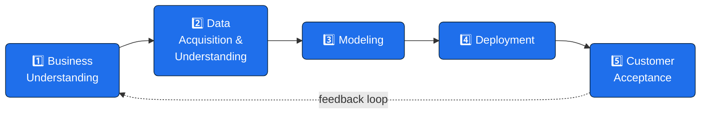
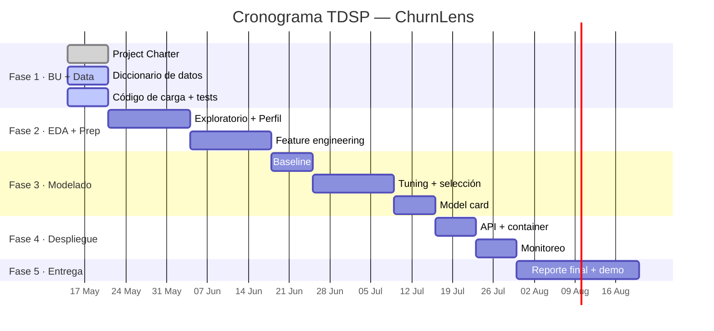

# Project Charter — Entendimiento del Negocio

> **Proyecto:** ChurnLens — Predicción temprana de _churn_ en servicios por suscripción
> **Diplomado:** _Machine Learning and Data Science_ (MLDS) — Universidad Nacional de Colombia
> **Módulo 6:** Desarrollo de Aplicaciones con _Machine Learning_
> **Fase actual:** **Fase 1 — Entendimiento del negocio y carga de datos** (10 % de la nota)
> **Autor:** Jhon Gallego · `jhgallegoa21@gmail.com`
> **Versión:** 1.0 · **Fecha:** 2026-05-14

---

## Tabla de contenidos

1. [Nombre del proyecto](#1-nombre-del-proyecto)
2. [Contexto y motivación](#2-contexto-y-motivación)
3. [Problema de negocio](#3-problema-de-negocio)
4. [Objetivo del proyecto](#4-objetivo-del-proyecto)
5. [Objetivos específicos (SMART)](#5-objetivos-específicos-smart)
6. [Alcance del proyecto](#6-alcance-del-proyecto)
7. [Metodología](#7-metodología)
8. [Métricas y criterios de éxito](#8-métricas-y-criterios-de-éxito)
9. [Cronograma](#9-cronograma)
10. [Equipo del proyecto](#10-equipo-del-proyecto)
11. [Presupuesto](#11-presupuesto)
12. [Stakeholders](#12-stakeholders)
13. [Riesgos y supuestos](#13-riesgos-y-supuestos)
14. [Restricciones y consideraciones éticas](#14-restricciones-y-consideraciones-éticas)
15. [Entregables de la Fase 1](#15-entregables-de-la-fase-1)
16. [Rúbrica y cumplimiento](#16-rúbrica-y-cumplimiento)
17. [Aprobaciones](#17-aprobaciones)
18. [Referencias](#18-referencias)

---

## 1. Nombre del proyecto

**ChurnLens** — _Predicción temprana de cancelación voluntaria de la suscripción (churn) en un servicio por suscripción._

El nombre combina las raíces _churn_ (rotación / cancelación) y _lens_ (lente, herramienta de observación analítica). El sistema funciona como una **lente predictiva** que enfoca a los clientes con mayor probabilidad de cancelar y permite priorizar acciones del equipo de retención.

---

## 2. Contexto y motivación

Los modelos de negocio basados en suscripción — telecomunicaciones, _streaming_, software como servicio (SaaS), banca digital, _fintech_, servicios públicos, entre otros — comparten un mismo dolor económico: la **fuga de clientes** (_churn_). Adquirir un nuevo cliente puede costar entre **5 y 25 veces más** que retener uno existente¹, y una mejora marginal de la retención tiene un impacto compuesto sobre el _MRR_ (_Monthly Recurring Revenue_) y el _LTV_ (_Lifetime Value_) que crece de forma no lineal.

A medida que estos servicios maduran, las acciones de retención _no segmentadas_ (campañas masivas, descuentos transversales, llamadas telefónicas a toda la base) **dejan de ser rentables**. La industria ha migrado hacia estrategias de retención dirigidas, donde un modelo predictivo identifica al subconjunto de clientes con alta probabilidad de cancelar y permite concentrar el esfuerzo del equipo comercial en ese segmento.

**ChurnLens** se enmarca en esta tendencia. Es un caso académico, reproducible y públicamente verificable, que recorre el ciclo completo de _Data Science_ desde el entendimiento del negocio hasta el despliegue, siguiendo la metodología **TDSP** (_Team Data Science Process_).

---

## 3. Problema de negocio

### 3.1 Enunciado del problema

> _Un proveedor de servicios por suscripción observa, mes a mes, que una fracción significativa de su base activa cancela voluntariamente el servicio. Las acciones reactivas actuales — descuentos al momento de la cancelación, _outbound_ de retención posterior al evento — son costosas y de baja conversión. Se requiere identificar **antes** del evento de cancelación a los clientes en riesgo, para que el equipo de retención pueda actuar de manera proactiva, dirigida y costo-eficiente._

### 3.2 Caracterización del problema (5W + 1H)

| Pregunta     | Respuesta                                                                                                                   |
|--------------|------------------------------------------------------------------------------------------------------------------------------|
| **¿Qué?**    | Predecir la probabilidad de que un cliente cancele voluntariamente su suscripción en el próximo ciclo de facturación.        |
| **¿Quién?**  | Clientes activos del servicio. La predicción se entrega al equipo de Retención.                                              |
| **¿Cuándo?** | La predicción se actualiza al cierre de cada ciclo mensual de facturación y se utiliza durante el siguiente ciclo.           |
| **¿Dónde?**  | Sistema interno consumido por el _CRM_ del equipo comercial; no es un sistema de cara al cliente final.                       |
| **¿Por qué?**| Para reducir _churn_, aumentar el _LTV_ y mejorar la eficiencia del gasto en retención.                                      |
| **¿Cómo?**   | Mediante un modelo de clasificación binaria supervisado entrenado sobre datos históricos de la base de suscriptores.         |

### 3.3 Por qué este problema es importante

- **Sensibilidad financiera:** una reducción de 1 punto porcentual en _churn_ mensual puede traducirse en miles de USD adicionales de _MRR_ retenido al año, dependiendo del tamaño de la base y del _ARPU_.
- **Asimetría costo-beneficio:** retener un cliente vale entre **5× y 25×** menos que adquirir uno nuevo¹. Cualquier _lift_ del modelo se compone con esta asimetría.
- **Asimetría de error:** los errores no son simétricos. _Falsos negativos_ (decir “no se va” cuando sí se va) cuestan mucho más que _falsos positivos_ (proteger a alguien que igual se iba a quedar). Esta asimetría se traduce directamente en la elección de métricas (priorizar **recall** y **lift en top-decil** sobre _accuracy_).
- **Aplicabilidad transversal:** la metodología es portable a cualquier negocio de suscripción.

---

## 4. Objetivo del proyecto

> **Diseñar, construir, evaluar y documentar un sistema de _machine learning_ end-to-end que prediga la probabilidad de _churn_ por cliente para el próximo ciclo de facturación, con métricas explícitas de negocio y de modelo, y que sea reproducible, auditable y desplegable como servicio.**

El proyecto no se limita al modelo: incluye la documentación de negocio (_business understanding_), la ingeniería de datos (carga, validación, limpieza, _feature engineering_), el modelado (_baseline_, modelos avanzados, _tuning_, evaluación), el despliegue (API y monitoreo) y la _governance_ (ética, privacidad, _model card_).

---

## 5. Objetivos específicos (SMART)

Cada objetivo cumple con los criterios SMART (_Specific, Measurable, Achievable, Relevant, Time-bound_).

| #   | Objetivo                                                                                                          | Métrica                                                       | Plazo            |
|-----|-------------------------------------------------------------------------------------------------------------------|---------------------------------------------------------------|------------------|
| O1  | Construir un pipeline de carga y validación del dataset reproducible end-to-end.                                  | El comando `make data` ejecuta sin errores y valida esquema.  | Fase 1 (s. 1–2) |
| O2  | Generar diccionarios de datos exhaustivos para las 21 variables del dataset.                                      | 21/21 variables documentadas con tipo, descripción y rango.   | Fase 1 (s. 1–2) |
| O3  | Establecer una _baseline_ predictiva con al menos un modelo lineal y uno basado en árboles.                       | ROC-AUC ≥ 0.80 sobre _holdout_ (clase 1 = _Yes_).             | Fase 3 (s. 7–10) |
| O4  | Igualar o superar la _baseline_ con un modelo tuneado.                                                             | ROC-AUC ≥ 0.85 y mejora ≥ 3 pp en F1 sobre _baseline_.        | Fase 3 (s. 7–10) |
| O5  | Producir una _model card_ con análisis de sesgo por al menos 2 atributos (género, _SeniorCitizen_).               | _Model card_ completa, _disparate impact_ reportado.          | Fase 3–5         |
| O6  | Desplegar el modelo como servicio REST con respuesta < 200 ms al p95.                                              | _Endpoint_ `/predict` documentado y _load-test_ pasado.       | Fase 4 (s. 11–12)|
| O7  | Documentar un plan de monitoreo en producción con métricas de _drift_ y de negocio.                                | Documento de monitoreo entregado y con alertas definidas.     | Fase 4           |

---

## 6. Alcance del proyecto

### 6.1 Incluye

- **Dataset:** _Telco Customer Churn_ (IBM Sample Data Sets) — 7 043 clientes × 21 variables. Fuente pública, sin información personal identificable (PII).
- **Problema:** clasificación binaria supervisada (target = `Churn ∈ {Yes, No}`).
- **Variables:** demográficas, contractuales, de servicios contratados, de cargos y de facturación.
- **Resultados esperados:**
  - Pipeline de datos validado.
  - EDA reproducible con un perfil completo del dataset.
  - Modelo predictivo entrenado, evaluado y empaquetado.
  - API REST de inferencia documentada con _OpenAPI_.
  - Documentación TDSP completa, incluida _model card_ y plan de monitoreo.
- **Criterios de éxito:** ver [§ 8](#8-métricas-y-criterios-de-éxito).

### 6.2 Excluye

- **No se usan datos reales** de ningún cliente, empresa, o sistema operacional. Todo se construye sobre el dataset público de IBM.
- **No se realiza modelado causal** ni inferencia de _treatment effect_ (uplift modeling) en esta versión inicial; queda registrado como _follow-up_ en la sección de mejoras futuras.
- **No se aborda churn involuntario** (cancelaciones por _credit-card decline_, mora, fraude). El target del dataset corresponde a cancelación voluntaria.
- **No se construye una interfaz web** para usuarios finales. El consumo es vía API o _batch_.
- **No se realiza A/B testing** real en producción dentro del alcance del curso.
- **No se construye un _data warehouse_**; los datos viven como archivos versionados en `data/`.

---

## 7. Metodología

El proyecto se desarrolla bajo la metodología **TDSP — Team Data Science Process** (Microsoft / Mindlab UNAL), que estructura el ciclo de vida en 5 fases iterativas:

Para cada fase se siguen los artefactos definidos por el template del Mindlab UNAL (`mindlab-unal/tdsp_template`):

| Fase TDSP                       | Artefactos clave                                                                                                                                                                          |
|---------------------------------|-------------------------------------------------------------------------------------------------------------------------------------------------------------------------------------------|
| 1. Business Understanding       | `project_charter.md` · `business_case.md` · `stakeholders.md` · `success_criteria.md` · `glossary.md`                                                                                     |
| 2. Data Acquisition & Understanding | `data_definition.md` · `data_dictionary.md` · `data_quality_report.md` · `scripts/data_acquisition/` · `scripts/eda/`                                                                  |
| 3. Modeling                     | `baseline_models.md` · `model_report.md` · `scripts/preprocessing/` · `scripts/training/` · `scripts/evaluation/`                                                                         |
| 4. Deployment                   | `deployment_doc.md` · API REST · _containerization_ · plan de monitoreo                                                                                                                   |
| 5. Customer Acceptance          | `exit_report.md` · demo · retro                                                                                                                                                            |

Adicionalmente, se aplican prácticas modernas de **MLOps ligero**: control de versiones (git + GitHub), CI con _GitHub Actions_, validación de datos con _Pandera_, validación de configuración con _Pydantic_, _typing_ estricto con `mypy`, y _logging_ estructurado con `structlog`.

---

## 8. Métricas y criterios de éxito

### 8.1 Métricas de negocio

| Métrica                                | Definición                                                                                  | Objetivo Fase 5     |
|----------------------------------------|---------------------------------------------------------------------------------------------|---------------------|
| **Churn rate mensual**                 | % de clientes activos al inicio del mes que cancelan durante el mes.                        | Reducir vs baseline |
| **Lift en top-decil**                  | Razón entre el % de churners reales en el decil de mayor riesgo y el % global.              | ≥ **3.0×**          |
| **Captura del 50 % del churn (recall)**| % del decil superior necesario para capturar la mitad de los churners reales.               | ≤ **20 %** de base  |
| **ROI estimado de la campaña**         | (MRR retenido − Costo de la campaña) / Costo de la campaña.                                 | ≥ **0** (positivo)  |

### 8.2 Métricas técnicas (modelo)

| Métrica            | Por qué se usa                                                                                  | Umbral Fase 3       |
|--------------------|-------------------------------------------------------------------------------------------------|---------------------|
| **ROC-AUC**        | Calidad de ranking de las probabilidades; insensible al umbral.                                 | ≥ **0.85**          |
| **PR-AUC**         | Más robusto que ROC-AUC ante desbalance de clases (~27 % positivos en el dataset).              | ≥ **0.65**          |
| **F1 (clase Yes)** | Balance entre _precision_ y _recall_ sobre la clase minoritaria.                                | ≥ **0.62**          |
| **Recall (clase Yes)** | Sensibilidad: % de churners reales correctamente identificados.                              | ≥ **0.70**          |
| **Calibration ECE**| Distancia entre probabilidad predicha y frecuencia observada (importante para priorización).     | ≤ **0.05**          |

### 8.3 Métricas de equidad y robustez

| Métrica                  | Definición                                                                                                          | Umbral              |
|--------------------------|---------------------------------------------------------------------------------------------------------------------|---------------------|
| **Disparate Impact**     | Razón de tasa de selección entre grupo desfavorecido y grupo favorecido para atributos protegidos (género, edad).   | ∈ [0.80, 1.25]      |
| **PSI (Population Stability Index)** | Estabilidad de la distribución de las _features_ entre _train_ y _holdout_.                                | < **0.10**          |

> Definiciones completas en [`success_criteria.md`](success_criteria.md).

---

## 9. Cronograma

El cronograma está alineado al calendario académico del Módulo 6 (ajustable según el calendario oficial del curso).

| Fase                                         | % nota | Duración estimada | Entregables clave                                          |
|----------------------------------------------|--------|-------------------|------------------------------------------------------------|
| 1. Entendimiento del negocio + carga         | 10 %   | 2 semanas         | Project Charter · Diccionarios · Código de carga            |
| 2. Análisis exploratorio + preprocesamiento  | 20 %   | 4 semanas         | EDA · Pipeline de limpieza · _Feature engineering_         |
| 3. Modelado + extracción de características  | 30 %   | 4 semanas         | Baseline · Modelos avanzados · _Tuning_ · _Model card_     |
| 4. Despliegue                                | 20 %   | 2 semanas         | API REST · _Container_ · Monitoreo                          |
| 5. Evaluación y entrega final                | 20 %   | 3 semanas         | Reporte final · Demo · Retrospectiva                       |

---

## 10. Equipo del proyecto

| Rol                                       | Integrante       | Responsabilidades                                                          |
|-------------------------------------------|------------------|-----------------------------------------------------------------------------|
| **Líder técnico · _Data Scientist_**      | Jhon Gallego     | Diseño, implementación, modelado, documentación, despliegue, _governance_.  |

> El proyecto se desarrolla de manera **individual** dentro del marco permitido por la rúbrica del curso (equipos de hasta 3 personas).

---

## 11. Presupuesto

El proyecto **no incurre en costos monetarios directos** dado que:

| Recurso                          | Costo  | Fuente                                                  |
|----------------------------------|--------|---------------------------------------------------------|
| Dataset                          | USD 0  | _Telco Customer Churn_ (IBM, dominio público académico).|
| Cómputo de entrenamiento         | USD 0  | Hardware local (sin GPU dedicada requerida).            |
| Almacenamiento                   | USD 0  | Repositorio GitHub privado dentro de la cuota gratuita. |
| _Hosting_ del API (Fase 4)       | USD 0  | _Free tier_ académico (ej. Render, Railway, HuggingFace Spaces). |
| Herramientas de desarrollo       | USD 0  | _Open source_ (`pandas`, `scikit-learn`, `pytest`, etc.).|
| **Total estimado**               | **USD 0** |                                                       |

El costo de oportunidad principal corresponde a las **~80 horas-persona** estimadas para todo el proyecto.

---

## 12. Stakeholders

| Stakeholder                              | Rol en el proyecto                                                                | Interés primario                                         |
|------------------------------------------|------------------------------------------------------------------------------------|----------------------------------------------------------|
| **Coordinador del Módulo 6 (UNAL)**      | Evaluador académico.                                                              | Cumplimiento de la rúbrica, calidad técnica, defensa.    |
| **Equipo docente del Diplomado MLDS**    | Acompañamiento metodológico.                                                      | Aplicación correcta de TDSP y buenas prácticas.          |
| **Estudiante / autor**                   | Ejecutor y dueño del proyecto.                                                    | Aprendizaje, calificación, portafolio profesional.       |
| **Comunidad académica**                  | Consumidor potencial del repositorio.                                             | Reproducibilidad, claridad, transparencia.               |
| **Equipo de Retención (rol hipotético)** | Usuario final del modelo en un escenario productivo simulado.                      | Lista priorizada de clientes en riesgo, accionable.      |
| **Equipo de Producto (rol hipotético)**  | Tomador de decisiones de _pricing_ y _packaging_ basados en hallazgos del modelo. | Insights sobre drivers de churn.                         |

> Detalle completo en [`stakeholders.md`](stakeholders.md).

---

## 13. Riesgos y supuestos

### 13.1 Riesgos

| ID    | Riesgo                                                                                                | Probabilidad | Impacto | Mitigación                                                                                                  |
|-------|-------------------------------------------------------------------------------------------------------|--------------|---------|-------------------------------------------------------------------------------------------------------------|
| R-01  | El dataset es relativamente pequeño (~7 K filas) y puede limitar la capacidad de generalización.       | Alta         | Medio   | _Cross-validation_ estratificada (k=5), evaluación robusta sobre múltiples seeds.                          |
| R-02  | Desbalance moderado de clases (~27 % positivos) puede sesgar las métricas tradicionales.              | Alta         | Medio   | Priorizar PR-AUC, F1, recall; usar `class_weight='balanced'` o resampling cuando aplique.                  |
| R-03  | Posible _data leakage_ por variables que dependen del _churn_ (ej. `TotalCharges` derivado).          | Media        | Alto    | Auditoría de _data leakage_ en EDA; documentar variables sospechosas y excluirlas si corresponde.          |
| R-04  | Sesgo algorítmico por género, edad u otras variables sensibles.                                        | Media        | Alto    | Análisis de _fairness_ por subgrupos; reporte de _disparate impact_ obligatorio en la _model card_.        |
| R-05  | Cambio de _scope_ del módulo durante el desarrollo.                                                   | Baja         | Medio   | Estructura TDSP modular permite iterar sobre entregables sin rehacer todo.                                  |
| R-06  | Limitaciones de tiempo del estudiante (rol único).                                                    | Media        | Alto    | Priorización por _MoSCoW_: _must-haves_ de la rúbrica primero, _nice-to-haves_ después.                    |
| R-07  | Dificultad para reproducir el entorno (versiones de librerías).                                       | Baja         | Medio   | `pyproject.toml` con _ranges_ explícitos; `Makefile` y `pre-commit` para uniformizar.                      |

### 13.2 Supuestos

- El dataset _Telco Customer Churn_ es representativo de un proveedor maduro de servicios por suscripción y sus variables son trasladables conceptualmente a otros negocios del mismo tipo.
- La etiqueta `Churn = Yes` representa cancelación voluntaria reciente (ventana del último mes).
- No hay PII en el dataset (el `customerID` es un identificador sintético).
- Las herramientas _open source_ del stack son suficientes para el alcance del proyecto.

---

## 14. Restricciones y consideraciones éticas

- **Privacidad:** ninguna información personal identificable se usa, almacena o transmite. El dataset es público, el `customerID` es sintético.
- **Equidad:** se realiza un análisis explícito de sesgo algorítmico sobre atributos protegidos (`gender`, `SeniorCitizen`, `Partner`, `Dependents`) en la _model card_.
- **Transparencia:** todas las decisiones del proyecto se documentan; el código es trazable y los modelos son auditables.
- **No-discriminación accionable:** las predicciones del modelo no se usan para denegar servicio, sino exclusivamente para **priorizar** acciones positivas de retención.
- **Reproducibilidad:** seed fijo (`42`), versiones de dependencias acotadas, hashes MD5 sobre el _raw_.

Detalle ampliado en [`docs/governance/ethics_and_fairness.md`](../governance/ethics_and_fairness.md).

---

## 15. Entregables de la Fase 1

| Entregable                | Ubicación                                                            | Estado |
|---------------------------|----------------------------------------------------------------------|--------|
| **Marco del proyecto**    | Este documento (`docs/business_understanding/project_charter.md`)    | ✅     |
| **Diccionarios de datos** | `docs/data/data_dictionary.md` · `docs/data/data_definition.md`      | ✅     |
| **Código de carga**       | `scripts/data_acquisition/main.py` · `src/churnlens/data/loader.py`  | ✅     |

Documentación complementaria entregada (más allá de lo exigido):

- `docs/business_understanding/business_case.md`
- `docs/business_understanding/stakeholders.md`
- `docs/business_understanding/success_criteria.md`
- `docs/business_understanding/glossary.md`
- `docs/data/data_quality_report.md`
- `docs/architecture/solution_architecture.md`
- `docs/governance/ethics_and_fairness.md`
- `docs/governance/privacy_and_compliance.md`
- `docs/governance/model_card.md` _(template)_
- `notebooks/01_data_acquisition_eda.ipynb`
- Suite de tests (`tests/`)
- Configuración CI/CD (`.github/workflows/ci.yml`)

---

## 16. Rúbrica y cumplimiento

La presente entrega corresponde al primer criterio de la rúbrica oficial del Módulo 6 — **"Entendimiento del negocio y carga de datos"** — que equivale al **10 %** de la nota total del proyecto aplicado.

### Mapeo de cumplimiento (rango objetivo: **4.0 – 5.0**)

| Subcriterio de la rúbrica                       | Evidencia en este repositorio                                                                  |
|--------------------------------------------------|------------------------------------------------------------------------------------------------|
| Marco del proyecto.                              | `docs/business_understanding/project_charter.md` (este documento, completo y autosuficiente).  |
| Código de carga de datos.                        | `scripts/data_acquisition/main.py` + módulo `src/churnlens/data/` + suite de tests `tests/`.   |
| Diccionarios de datos.                           | `docs/data/data_dictionary.md` (21/21 variables) + `docs/data/data_definition.md`.             |
| Los documentos contienen información que corresponde a lo solicitado. | Sí — más adicionales (_business case_, _model card_, _ethics_, arquitectura, CI). |
| El código de carga de datos funciona bien.       | Validación end-to-end con `make data` · tests automatizados · CI en GitHub Actions.            |

---

## 17. Aprobaciones

| Rol                                | Nombre        | Fecha         | Firma / Validación                                    |
|------------------------------------|---------------|---------------|-------------------------------------------------------|
| **Autor / Líder técnico**          | Jhon Gallego  | 2026-05-14    | Commit firmado en `main` con tag `v0.1.0-fase1`.      |
| Coordinación Módulo 6 (UNAL)       | _(pendiente)_ | _(pendiente)_ | _(pendiente)_                                          |

---

## 18. Referencias

1. Gallo, A. (2014). _The Value of Keeping the Right Customers._ Harvard Business Review.
2. IBM Cognos Analytics. _Telco Customer Churn dataset_. Disponible en Kaggle.
3. Microsoft. _Team Data Science Process (TDSP)_. https://learn.microsoft.com/en-us/azure/architecture/data-science-process/overview
4. Mindlab UNAL. _TDSP Template_. https://github.com/mindlab-unal/tdsp_template
5. Mitchell, M. et al. (2019). _Model Cards for Model Reporting_. FAT*'19.
6. Pandera Documentation. https://pandera.readthedocs.io/
7. Reichheld, F. F. (1996). _The Loyalty Effect_. Harvard Business School Press.

---

_Documento elaborado para el Proyecto Aplicado del Módulo 6 — Diplomado MLDS, Universidad Nacional de Colombia._
