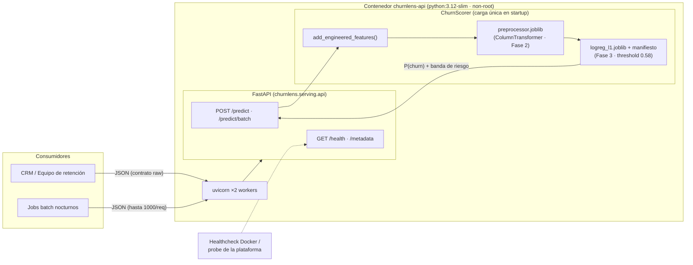

# Despliegue del modelo — ChurnLens

> Entregable de Fase 4 (Diplomado MLDS · UNAL) ·
> Fecha: 2026-06-03 · Modelo desplegado: **`logreg_l1`** ·
> Threshold operativo: **0.58** (sintonizado en Fase 3).
>
> Forma de despliegue: **API REST (FastAPI + uvicorn) empaquetada en
> Docker**, lista para cualquier runtime de contenedores.

Este documento responde a la rúbrica:

> _"Código de despliegue que permita la puesta en producción del modelo
> entrenado. Documentación del despliegue que explique el proceso de
> implementación y configuración del modelo en el entorno de producción."_

Sigue la estructura del template TDSP
([`docs/deployment/deploymentdoc.md`](https://github.com/mindlab-unal/tdsp_template/tree/master/docs/deployment))
y se complementa con la
[documentación de infraestructura](infrastructure.md) (plataformas,
costos y mantenimiento).

---

## 1. Infraestructura

### 1.1 Identidad del despliegue

| Campo | Valor |
|-------|-------|
| **Nombre del modelo** | `logreg_l1` — `sklearn.linear_model.LogisticRegression` (L1, `class_weight=balanced`), ganador de la Fase 3 ([reporte](../modeling/final_model_report.md)) |
| **Forma de despliegue** | Servicio HTTP de inferencia (FastAPI + uvicorn) en contenedor Docker |
| **Plataforma de despliegue** | Cualquier runtime OCI: Docker local / VPS, **Google Cloud Run** (recomendada), AWS App Runner / ECS Fargate, Railway / Render — análisis comparativo y de costos en [infrastructure.md §4](infrastructure.md#4-opciones-de-plataforma-y-costos) |
| **Imagen** | `churnlens-api` (multi-stage, base `python:3.12-slim`, usuario no-root) |
| **Endpoints** | `GET /health` · `GET /metadata` · `POST /predict` · `POST /predict/batch` · docs interactivas en `/docs` y `/redoc` |

### 1.2 Requisitos técnicos

| Requisito | Valor | Notas |
|-----------|-------|-------|
| Python | ≥ 3.10 (imagen: 3.12-slim) | Misma matriz que el CI (3.10–3.12) |
| Dependencias de serving | `fastapi>=0.111`, `uvicorn[standard]>=0.29`, `scikit-learn>=1.4`, `pandas>=2.2`, `pydantic>=2.6` | Declaradas en [`pyproject.toml`](../../pyproject.toml) |
| Hardware | 1 vCPU · 512 MB RAM | Sin GPU. El estimador pesa **1.1 KB** y el preprocesador **~10 KB** |
| Docker | Engine ≥ 24 (con BuildKit) | Solo para la vía contenedor |
| Red (solo build) | Acceso HTTPS al mirror IBM del dataset | El builder reconstruye los artefactos desde cero |
| Latencia esperada | p50 ≈ 20 ms por predicción individual (in-process) | Header `X-Process-Time-Ms` en cada respuesta |

### 1.3 Requisitos de seguridad

| Control | Implementación |
|---------|----------------|
| Validación estricta de entrada | Contratos Pydantic con dominios cerrados (`Literal`), rangos (`tenure` 0–72) y reglas de integridad cruzada del esquema Pandera — payloads fuera de contrato → `422` |
| Superficie de entrada acotada | `extra="forbid"` (campos desconocidos rechazados) y batch limitado a 1 000 clientes/request |
| Contenedor endurecido | Usuario no-root (`churnlens`, uid 1000), imagen slim sin compiladores, sin shell de depuración necesaria |
| Sin secretos en la imagen | No hay credenciales: el dataset es público y la configuración entra por variables de entorno (`.env` está en `.gitignore`) |
| Anti-tampering | SHA-256 del artefacto (`hash_model`) expuesto en `GET /metadata` y registrado en el manifiesto |
| Privacidad | El servicio **no persiste** los payloads; `customerID` solo se ecoa en la respuesta ([privacy & compliance](../governance/privacy_and_compliance.md)) |
| TLS y autenticación | Delegadas a la capa de ingress (API gateway / reverse proxy / plataforma). Recomendación productiva: API key o OIDC en el gateway — ver [infrastructure.md §6](infrastructure.md#6-seguridad) |

### 1.4 Diagrama de arquitectura



El flujo de inferencia reproduce **exactamente** el pipeline de
entrenamiento: payload crudo → features derivadas (Fase 2) →
`ColumnTransformer` ajustado solo sobre `train` (sin leakage) → modelo →
decisión con el threshold sintonizado. Los tres artefactos se cargan una
sola vez en el *startup* (fail-fast si faltan).

---

## 2. Código de despliegue

### 2.1 Archivo principal

**[`src/churnlens/serving/api.py`](../../src/churnlens/serving/api.py)** —
aplicación FastAPI (`create_app()` + instancia module-level `app`).
Punto de arranque productivo:

```bash
uvicorn churnlens.serving.api:app --host 0.0.0.0 --port 8000 --workers 2
# equivalentes: `churnlens serve` · `make serve` (dev) · CMD del Dockerfile
```

### 2.2 Rutas de acceso a los archivos

| Archivo | Rol |
|---------|-----|
| [`src/churnlens/serving/api.py`](../../src/churnlens/serving/api.py) | Aplicación FastAPI: endpoints, lifespan, middleware de latencia |
| [`src/churnlens/serving/service.py`](../../src/churnlens/serving/service.py) | `ChurnScorer` — pipeline de inferencia completo |
| [`src/churnlens/serving/schemas.py`](../../src/churnlens/serving/schemas.py) | Contratos Pydantic de entrada/salida (espejo del [data dictionary](../data/data_dictionary.md)) |
| [`src/churnlens/cli.py`](../../src/churnlens/cli.py) | Comando `churnlens serve` |
| [`scripts/deployment/main.py`](../../scripts/deployment/main.py) | Smoke test E2E oficial de la fase (evidencia en `reports/tables/deployment_smoke.json`) |
| [`Dockerfile`](../../Dockerfile) | Build multi-stage de la imagen de producción |
| [`docker-compose.yml`](../../docker-compose.yml) | Orquestación local / single-host con healthcheck y límites de recursos |
| [`.dockerignore`](../../.dockerignore) | Contexto de build mínimo |
| [`tests/test_serving_service.py`](../../tests/test_serving_service.py) · [`tests/test_serving_api.py`](../../tests/test_serving_api.py) | 31 tests del scorer y de la API |
| [`.github/workflows/ci.yml`](../../.github/workflows/ci.yml) | Jobs `smoke-test-phase4` y `docker-smoke` |

Artefactos consumidos en runtime (generados por Fases 2–3, **reconstruidos
dentro del builder de Docker** — no se versionan):

| Artefacto | Ruta local | Ruta en imagen |
|-----------|-----------|----------------|
| Modelo serializado | `models/logreg_l1.joblib` | `/app/models/logreg_l1.joblib` |
| Manifiesto del modelo | `models/logreg_l1.metadata.json` | `/app/models/logreg_l1.metadata.json` |
| Preprocesador ajustado | `data/processed/preprocessor.joblib` | `/app/data/processed/preprocessor.joblib` |

### 2.3 Variables de entorno

| Variable | Default | Propósito |
|----------|---------|-----------|
| `CHURNLENS_SERVING_MODEL` | `logreg_l1` | Modelo del registro a servir |
| `CHURNLENS_SERVING_THRESHOLD` | _(vacío)_ | Override del threshold; si se omite se usa el sintonizado del manifiesto (0.58) |
| `CHURNLENS_MODELS_DIR` | `<repo>/models` (imagen: `/app/models`) | Registro de modelos |
| `CHURNLENS_DATA_DIR` | `<repo>/data` (imagen: `/app/data`) | Raíz de datos (el preprocesador vive en `processed/`) |
| `CHURNLENS_API_HOST` / `CHURNLENS_API_PORT` | `127.0.0.1` / `8000` | Bind de `churnlens serve` (el contenedor usa `0.0.0.0`) |
| `LOG_LEVEL` / `LOG_FORMAT` | `INFO` / `console` (imagen: `json`) | Logging estructurado (structlog) |

Plantilla completa en [`.env.example`](../../.env.example).

---

## 3. Documentación del despliegue

### 3.1 Instrucciones de instalación

**Vía A — Docker (recomendada, autocontenida):**

```bash
git clone https://github.com/jhonevergallegoate/churnlens.git
cd churnlens
docker build -t churnlens-api .        # ≈ 5 min: instala + descarga datos + entrena
docker run --rm -p 8000:8000 churnlens-api
```

El build **no depende de artefactos locales**: la etapa builder descarga el
dataset (con verificación de checksum), ajusta el preprocesador y entrena
`logreg_l1` con la semilla fija del proyecto (42), garantizando una imagen
reproducible desde cualquier checkout limpio.

**Vía B — docker compose (healthcheck + límites de recursos):**

```bash
docker compose up --build -d           # make docker-up
curl http://localhost:8000/health
docker compose down                    # make docker-down
```

**Vía C — local sin contenedor (desarrollo):**

```bash
make install-dev                       # pip install -e ".[all]"
make phase3                            # genera preprocesador + modelos (si no existen)
churnlens serve                        # http://127.0.0.1:8000
```

### 3.2 Instrucciones de configuración

1. Copiar la plantilla: `cp .env.example .env`.
2. Ajustar las variables de la tabla §2.3 según el entorno. Las dos
   decisiones operativas relevantes:
   * **Threshold** — por defecto rige el 0.58 sintonizado en Fase 3
     (maximiza F1 en `val`). Para una campaña con más presupuesto de
     retención (más recall, menos precision) puede bajarse vía
     `CHURNLENS_SERVING_THRESHOLD` **sin reconstruir la imagen**.
   * **Modelo** — `CHURNLENS_SERVING_MODEL` permite servir cualquier
     entrada del registro (`churnlens model list`), p. ej. un challenger.
3. En producción: `LOG_FORMAT=json` (ya es el default de la imagen) para
   integración con agregadores de logs.

### 3.3 Instrucciones de uso

Documentación interactiva (Swagger UI) en `http://localhost:8000/docs`.

**Puntuar un cliente:**

```bash
curl -s -X POST http://localhost:8000/predict \
  -H "Content-Type: application/json" \
  -d '{
    "customerID": "9237-HQITU",
    "gender": "Female", "SeniorCitizen": 0, "Partner": "No", "Dependents": "No",
    "tenure": 2, "PhoneService": "Yes", "MultipleLines": "No",
    "InternetService": "Fiber optic", "OnlineSecurity": "No", "OnlineBackup": "No",
    "DeviceProtection": "No", "TechSupport": "No", "StreamingTV": "No",
    "StreamingMovies": "No", "Contract": "Month-to-month",
    "PaperlessBilling": "Yes", "PaymentMethod": "Electronic check",
    "MonthlyCharges": 70.70, "TotalCharges": 151.65
  }'
```

```json
{
  "customerID": "9237-HQITU",
  "probability": 0.8684,
  "prediction": 1,
  "label": "churn",
  "risk_band": "high",
  "model": "logreg_l1",
  "threshold": 0.58
}
```

**Puntuar un lote** (hasta 1 000 clientes, orden preservado):

```bash
curl -s -X POST http://localhost:8000/predict/batch \
  -H "Content-Type: application/json" \
  -d '{"customers": [ { ...cliente1... }, { ...cliente2... } ]}'
```

La respuesta incluye un `summary` (clientes, churn predicho, tasa,
probabilidad media) pensado para los jobs batch del equipo de retención.

**Interpretación de la salida:**

| Campo | Lectura operativa |
|-------|-------------------|
| `probability` | P(churn) en el próximo ciclo de facturación |
| `prediction` / `label` | Decisión al threshold vigente (1 = intervenir) |
| `risk_band` | `high` ≥ 0.58 → intervención prioritaria · `medium` ≥ 0.29 → nurturing · `low` → sin acción |

**Verificación operativa:**

```bash
curl http://localhost:8000/health      # liveness
curl http://localhost:8000/metadata    # modelo, métricas, hash SHA-256
make deploy-smoke                      # smoke E2E in-process (5 checks)
```

### 3.4 Instrucciones de mantenimiento

| Tarea | Procedimiento | Cadencia |
|-------|--------------|----------|
| Re-entrenamiento | `make phase3` con datos frescos → nuevo manifiesto → `docker build` → redeploy | Trimestral o al disparo de drift ([infrastructure.md §7](infrastructure.md#7-plan-de-mantenimiento-y-monitoreo)) |
| Actualización de dependencias | Editar `pyproject.toml` → `make check` → rebuild de imagen | Mensual / CVE |
| Rollback | Las imágenes se etiquetan por versión (`churnlens-api:0.3.0`); volver a la etiqueta anterior | Ante degradación |
| Verificación post-deploy | `GET /health` + `GET /metadata` (comparar `hash_model` con el manifiesto esperado) + `make deploy-smoke` | Cada deploy |
| Monitoreo continuo | Latencia (`X-Process-Time-Ms`), tasa de `422`/`5xx`, PSI de features y tasa de churn predicha | Continuo |

El plan completo de monitoreo, los presupuestos de costo por plataforma y
el runbook operativo están en [infrastructure.md](infrastructure.md).

---

## 4. Validación del despliegue

### 4.1 Evidencia automatizada

| Verificación | Dónde | Resultado |
|--------------|-------|-----------|
| 31 tests de serving (scorer + API + contratos) | `tests/test_serving_*.py` (suite total: **128 tests**, cobertura 86 %) | ✅ |
| Smoke E2E in-process (5 checks, 4 endpoints) | `scripts/deployment/main.py` → `reports/tables/deployment_smoke.json` | ✅ |
| Smoke HTTP real sobre la imagen Docker | CI job [`docker-smoke`](../../.github/workflows/ci.yml) (build → run → `/health` → `/predict`) | ✅ |
| Pipeline reproducible Fase 1→4 en CI | Jobs `smoke-test-pipeline` → `smoke-test-phase2` → `smoke-test-phase3` → `smoke-test-phase4` | ✅ |

### 4.2 Desempeño held-out (`test.parquet`, intocado hasta esta fase)

Conforme a lo comprometido en Fase 3, el conjunto de prueba se evaluó por
primera vez en esta fase (threshold fijo 0.58, sin re-sintonización):

| Métrica | `val` (Fase 3) | `test` (Fase 4) | Δ |
|---------|---------------:|----------------:|---:|
| PR-AUC | 0.6293 | **0.6313** | +0.002 |
| ROC-AUC | 0.8286 | **0.8460** | +0.017 |
| F1 @ 0.58 | 0.6390 | 0.6145 | −0.025 |
| Recall @ 0.58 | 0.7402 | 0.7286 | −0.012 |
| Precision @ 0.58 | 0.5622 | 0.5312 | −0.031 |
| Brier | 0.1700 | 0.1678 | −0.002 |
| Lift @ 10 % | 2.70× | **2.78×** | +0.08 |

**Lectura:** sin degradación material entre `val` y `test` — las métricas
de ranking (PR-AUC, ROC-AUC, lift) incluso mejoran levemente. El modelo
desplegado generaliza y el threshold sintonizado en `val` se sostiene en
datos nunca vistos. Evidencia: `reports/tables/evaluation_summary_logreg_l1.json`.
