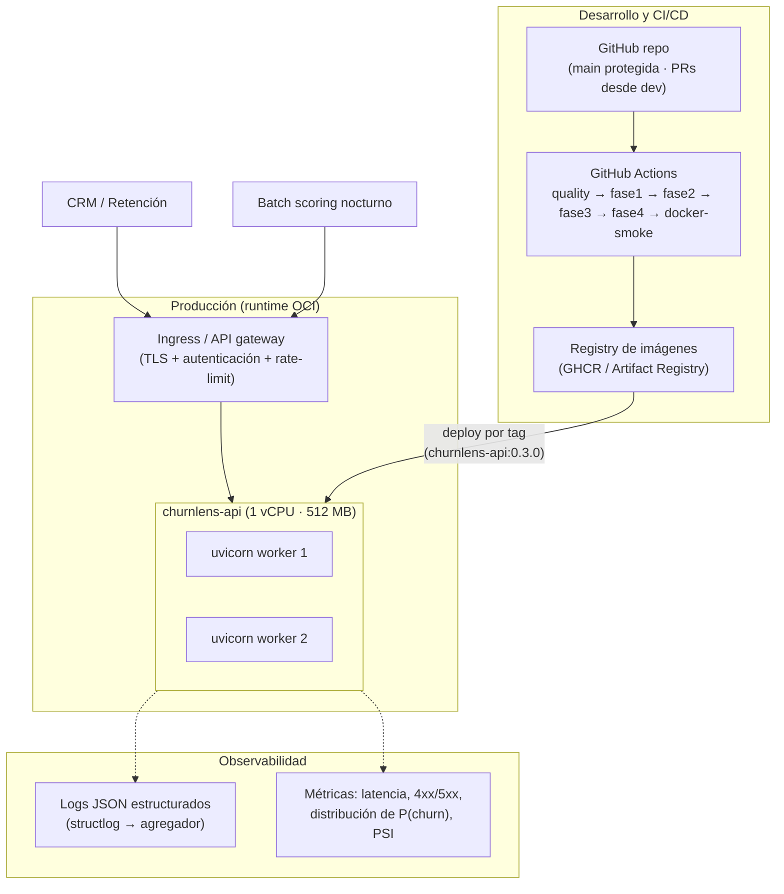

# Infraestructura de despliegue — ChurnLens

> Entregable de Fase 4 (Diplomado MLDS · UNAL) · Fecha: 2026-06-03 ·
> Servicio: **`churnlens-api`** (contenedor Docker · FastAPI + uvicorn).
>
> Complementa a [deploymentdoc.md](deploymentdoc.md) con el detalle de
> componentes, dimensionamiento, plataformas candidatas, **costos** y
> **plan de mantenimiento** de la infraestructura.

Este documento responde a la rúbrica:

> _"Documentación de la infraestructura necesaria para el despliegue y
> funcionamiento del modelo. […] Se ha proporcionado información relevante
> sobre los costos y el mantenimiento de la infraestructura."_

---

## 1. Visión general

La solución se despliega como **un único servicio stateless** empaquetado
en una imagen OCI. No requiere base de datos, colas ni almacenamiento
persistente: los tres artefactos de inferencia (modelo de 1.1 KB,
preprocesador de ~10 KB y manifiesto JSON) viajan **dentro de la imagen**,
horneados por el propio `docker build` de forma reproducible (semilla fija
42 — la imagen reconstruida produce probabilidades byte-equivalentes).



**Principios de diseño:**

1. **Stateless** — cualquier réplica responde cualquier request; escalar es
   añadir réplicas detrás del balanceador.
2. **Inmutable** — no se actualizan modelos "en caliente": cada versión del
   modelo es una nueva imagen etiquetada; el rollback es volver al tag
   anterior.
3. **Fail-fast** — el scorer se carga en el *startup*; si los artefactos
   faltan o no casan, el contenedor nunca pasa el healthcheck.
4. **Mínimo privilegio** — usuario no-root, sin secretos en la imagen, sin
   acceso saliente requerido en runtime.

---

## 2. Componentes

| Componente | Tecnología | Rol | Estado |
|------------|-----------|-----|--------|
| Servidor ASGI | uvicorn (2 workers) | Concurrencia y ciclo de vida del proceso | Incluido en la imagen |
| Framework API | FastAPI + Pydantic v2 | Endpoints, validación de contratos, OpenAPI | Incluido |
| Pipeline de inferencia | `ChurnScorer` (sklearn) | features derivadas → `ColumnTransformer` → `logreg_l1` → threshold | Incluido |
| Healthcheck | Docker `HEALTHCHECK` → `GET /health` | Liveness/readiness para orquestadores | Incluido |
| Logging | structlog (JSON en producción) | Trazabilidad por request | Incluido |
| Ingress / TLS / auth | Gateway de la plataforma o reverse proxy (nginx/Caddy) | Terminación TLS, API keys, rate-limit | **Responsabilidad de la plataforma** |
| Registry de imágenes | GHCR / Artifact Registry / ECR | Versionado y distribución de imágenes | Externo |
| CI/CD | GitHub Actions ([ci.yml](../../.github/workflows/ci.yml)) | Calidad + smokes Fase 1→4 + build/smoke Docker | Configurado |

---

## 3. Dimensionamiento de recursos

El modelo es una regresión logística: la inferencia es un producto
matriz-vector de 35 dimensiones — el costo dominante es el `transform`
de pandas/sklearn, no el modelo.

| Recurso | Asignación | Justificación |
|---------|-----------:|---------------|
| CPU | 1 vCPU | p50 ≈ 20 ms/predicción individual; un lote de 1 000 ≈ 20 ms total (vectorizado) |
| RAM | 512 MB | Proceso base (~150 MB con pandas/sklearn) × 2 workers + margen |
| Disco | < 1.1 GB (imagen) | Sin volúmenes persistentes; los artefactos pesan < 20 KB |
| Réplicas | 1 (académico) · 2+ (producción) | 2+ elimina el punto único de falla |
| Throughput estimado | ~100 req/s por réplica (individual) · ~50 000 clientes/s en batch | Suficiente: la base completa (7 043 clientes) se puntúa en < 1 s |

---

## 4. Opciones de plataforma y costos

Cuatro escenarios evaluados para un servicio de este tamaño
(1 vCPU / 512 MB, tráfico bajo-medio: scoring batch diario + consultas
puntuales del CRM). Precios de lista a 2026, región `us-east`/`us-central`,
en USD:

| Plataforma | Modelo de cobro | Costo mensual estimado | Pros | Contras |
|------------|----------------|----------------------:|------|---------|
| **Google Cloud Run** ★ recomendada | Por uso (vCPU-s + GiB-s + requests), **scale-to-zero** | **$0 – 5** con tráfico académico/batch (capa gratuita: 180 000 vCPU-s + 360 000 GiB-s + 2 M requests/mes) | Cero costo en reposo, TLS y autoscaling gestionados, deploy = `gcloud run deploy --image` | Cold start ~2-4 s tras inactividad |
| AWS App Runner / ECS Fargate | Instancia activa (0.25 vCPU/0.5 GB mínimo en Fargate) | $15 – 30 (siempre encendido) | Integración IAM/VPC, sin gestión de servidores | Sin scale-to-zero real (App Runner cobra memoria en idle) |
| VPS (Hetzner CX22 / DigitalOcean Basic) | Tarifa plana | $5 – 8 | Control total, costo predecible, sirve para otros servicios | Mantenimiento del SO/TLS/monitoreo a cargo del equipo |
| Railway / Render (hobby) | Tarifa plana + horas | $0 – 7 | Deploy desde GitHub en minutos, ideal para demos | Límites de la capa gratuita (sleep tras inactividad) |

**Recomendación:** Google Cloud Run. El patrón de uso del equipo de
retención (un scoring batch nocturno + consultas esporádicas) encaja con
*scale-to-zero*: el costo mensual proyectado cae dentro de la capa
gratuita (≈ **$0**), con techo < $5 ante picos. El despliegue es un solo
comando a partir de la misma imagen verificada en CI:

```bash
gcloud run deploy churnlens-api \
  --image us-central1-docker.pkg.dev/<proyecto>/ml/churnlens-api:0.3.0 \
  --cpu 1 --memory 512Mi --min-instances 0 --max-instances 3 \
  --no-allow-unauthenticated
```

**Costos no-cloud asociados (todos $0 en este proyecto):**

| Ítem | Costo |
|------|------:|
| GitHub (repo + Actions, plan free: 2 000 min/mes — el pipeline completo usa ~15 min/run) | $0 |
| Registry de imágenes (GHCR, dentro de límites free) | $0 |
| Dataset (público, licencia abierta IBM) | $0 |
| Licencias de software (stack 100 % open source: MIT/BSD/Apache) | $0 |

---

## 5. Escalabilidad

| Eje | Mecanismo | Límite práctico |
|-----|-----------|-----------------|
| Vertical (en proceso) | `--workers N` de uvicorn (CPU-bound → ~1 worker por vCPU) | Tamaño de la instancia |
| Horizontal | Réplicas stateless detrás del balanceador (`docker compose --scale`, `--max-instances` en Cloud Run) | Ninguno relevante a esta escala |
| Batch | `POST /predict/batch` vectorizado (1 000 clientes/request) | Memoria por request (~2 MB/lote) |
| Datos | Si el volumen creciera 100×, el mismo diseño sirve; el cuello sería el upstream (CRM), no la inferencia | — |

La decisión de Fase 3 de elegir el modelo más simple (`logreg_l1` en empate
estadístico con alternativas 30 MB+ como Random Forest) es lo que hace esta
capa trivialmente escalable: imagen liviana, arranque < 5 s, inferencia en
milisegundos sin GPU.

---

## 6. Seguridad

| Capa | Control | Detalle |
|------|---------|---------|
| Entrada | Validación Pydantic estricta | Dominios cerrados, rangos, integridad cruzada, `extra="forbid"`, batch ≤ 1 000 — ver [deploymentdoc.md §1.3](deploymentdoc.md#13-requisitos-de-seguridad) |
| Transporte | TLS en el ingress | Cloud Run lo gestiona; en VPS, reverse proxy con certificados automáticos |
| Autenticación | `--no-allow-unauthenticated` (Cloud Run/IAM) o API key en el gateway | El servicio en sí no expone datos sensibles, pero el acceso debe restringirse al CRM y jobs autorizados |
| Contenedor | Non-root (uid 1000), base slim, sin compiladores ni shells extra | Superficie de ataque mínima |
| Supply chain | Imagen reconstruible desde el repo; `hash_model` SHA-256 verificable vía `GET /metadata` contra el manifiesto versionado | Detecta sustitución del artefacto |
| Privacidad | Sin persistencia de payloads; logs sin PII (solo `customerID` sintético) | Alineado con [privacy & compliance](../governance/privacy_and_compliance.md) |

---

## 7. Plan de mantenimiento y monitoreo

### 7.1 Monitoreo operativo (continuo)

| Señal | Fuente | Umbral de alerta |
|-------|--------|------------------|
| Disponibilidad | `GET /health` (probe de la plataforma) | 2 fallos consecutivos → restart; 5 → page |
| Latencia | Header `X-Process-Time-Ms` agregado desde logs | p95 > 200 ms sostenido |
| Tasa de errores | Logs JSON (`4xx`, `5xx`) | `5xx` > 0.1 % · `422` > 5 % (señal de drift de esquema upstream) |
| Distribución de P(churn) | Media y deciles de `probability` por día | Desplazamiento > 5 pp de la media semanal |

### 7.2 Monitoreo del modelo (semanal/mensual)

| Señal | Método | Acción al disparo |
|-------|--------|-------------------|
| Data drift por feature | PSI entre la distribución de scoring y la de `train` | PSI > 0.2 en features top (Contract, tenure, InternetService) → investigar; > 0.25 → re-entrenar |
| Churn rate predicho vs real | Comparar predicciones con cancelaciones observadas del ciclo | Caída de PR-AUC retrospectiva > 10 % → re-entrenar |
| Calibración | Brier score retrospectivo mensual | Brier > 0.19 → recalibrar (isotónica) |

### 7.3 Ciclo de re-entrenamiento

1. Refrescar datos y correr `make phase3` (selección + entrenamiento + evaluación).
2. Revisar el manifiesto del candidato vs producción (PR-AUC val, calibración, fairness).
3. `docker build` → nueva etiqueta (`churnlens-api:0.4.0`) → CI verde (incluye `docker-smoke`).
4. Deploy canario o directo según plataforma; verificar `GET /metadata` (nuevo `hash_model`).
5. Rollback = redeploy del tag anterior (las imágenes previas quedan en el registry).

**Cadencia:** trimestral por defecto, o anticipada por cualquiera de los
disparadores de §7.2.

### 7.4 Costo de mantenimiento estimado

| Actividad | Esfuerzo | Frecuencia |
|-----------|---------:|------------|
| Revisión de dashboards de monitoreo | 0.5 h | Semanal |
| Actualización de dependencias + rebuild | 1 h | Mensual |
| Ciclo completo de re-entrenamiento + deploy | 3 – 4 h | Trimestral |
| **Total anual aproximado** | **~60 h** (≈ 0.03 FTE) | — |

El bajo costo total (infraestructura ≈ $0–60/año + ~60 h/año de operación)
es consecuencia directa de las decisiones de diseño: modelo lineal liviano,
servicio stateless sin estado externo y pipeline 100 % reproducible.

---

## 8. Referencias

* [deploymentdoc.md](deploymentdoc.md) — proceso de despliegue, configuración y uso.
* [solution_architecture.md](../architecture/solution_architecture.md) — arquitectura completa de la solución (Fases 1–4).
* [final_model_report.md](../modeling/final_model_report.md) — modelo desplegado y sus métricas.
* [ci.yml](../../.github/workflows/ci.yml) — pipeline de verificación continua (jobs `smoke-test-phase4` y `docker-smoke`).
* Template TDSP de referencia: [mindlab-unal/tdsp_template — docs/deployment](https://github.com/mindlab-unal/tdsp_template/tree/master/docs/deployment).
